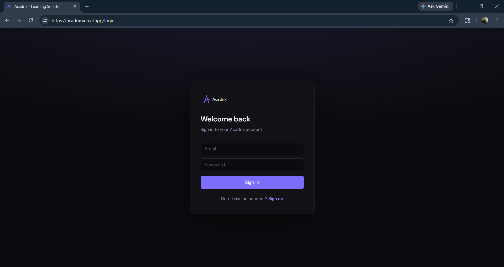
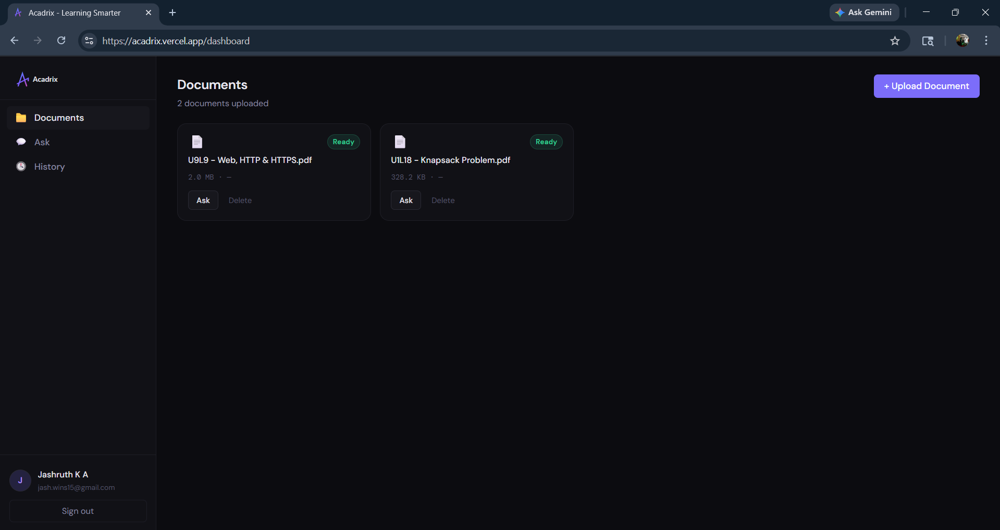
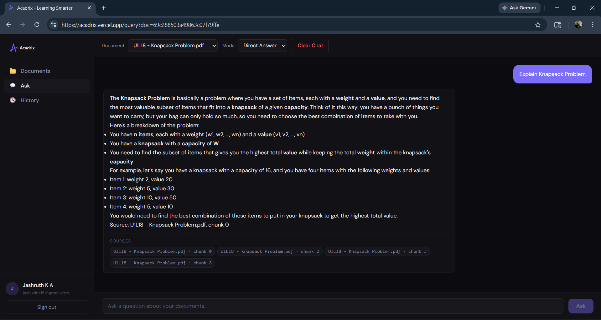
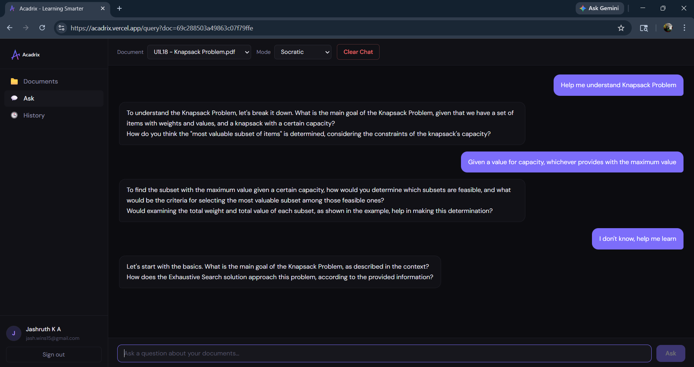
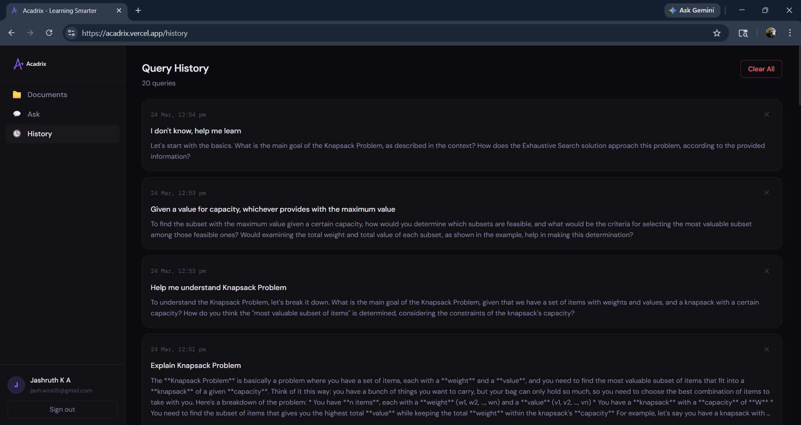

# Acadrix

> AI in Education (EdTech) focused on syllabus-bound, hallucination-free answers with adaptive study modes.

Acadrix is a RAG-powered academic assistant that lets students upload their study materials and ask questions — getting precise, document-grounded answers with zero hallucination. Built for students who want to study smarter, not harder.

---

## ⚠️ Important — Cold Start Notice

> The backend is hosted on **Render's free tier**, which spins down after 15 minutes of inactivity.
> **The first request (login/register) may take up to ~45 seconds** while the server wakes up.
> This is expected behaviour — subsequent requests will be fast.
>
> Please be patient on first load. The app is fully functional once the server is awake.

---

## 🚀 Live Demo

| | Link |
|---|---|
| **Frontend** | [your-app.vercel.app](https://acadrix.vercel.app) |
| **Backend API Docs** | [your-api.onrender.com/docs](https://acadrix.onrender.com/docs) |  

> 💡 Tip: Open the backend API docs link first to wake the server before navigating to the frontend.

---

## Screenshots

### Login


### Dashboard


### Asking a Question (Direct Mode)


### Socratic Study Mode


### Query History


> 📸 _Screenshots above show the app running after the backend has warmed up._

---

## Features

- **Document-Grounded Answers** — Responses are strictly sourced from uploaded materials. If it's not in your documents, Acadrix won't make it up.
- **Adaptive Study Modes** — Switch between Direct Answer mode for quick answers and Socratic mode for guided learning through questions.
- **Conversation Memory** — Follow-up questions like "explain again" or "I didn't understand" are handled intelligently by reusing previous context.
- **Persistent Indexes** — FAISS indexes are stored in MongoDB GridFS, surviving server restarts and redeployments.
- **Multi-Document Support** — Upload multiple documents and query across all of them simultaneously.
- **Query History** — Every question and answer is saved and accessible for review.
- **JWT Authentication** — Secure user accounts with token-based authentication.
- **Source Citations** — Every answer includes the source file and chunk it was derived from.

---

## Tech Stack

**Frontend**
- React + Vite
- React Router
- Axios
- React Markdown

**Backend**
- FastAPI
- MongoDB Atlas — database + GridFS for FAISS index persistence
- FAISS — vector similarity search
- Hugging Face Inference API — document embeddings (`all-MiniLM-L6-v2`)
- Groq (LLaMA 3.3 70B) — LLM inference
- JWT — authentication
- pdfplumber / python-pptx — document parsing

---

## Project Structure

```
acadrix/
├── backend/
│   ├── main.py
│   ├── auth.py
│   ├── config.py
│   ├── database.py
│   ├── models.py
│   ├── routers/
│   │   ├── auth.py
│   │   ├── documents.py
│   │   ├── query.py
│   │   └── history.py
│   └── pipeline/
│       ├── ingest.py
│       ├── embeddings.py
│       ├── query.py
│       └── vector_store.py
└── frontend/
    └── src/
        ├── api.js
        ├── App.jsx
        ├── index.css
        ├── components/
        │   ├── Sidebar.jsx
        │   └── ProtectedRoute.jsx
        ├── context/
        │   └── AuthContext.jsx
        └── pages/
            ├── Login.jsx
            ├── Register.jsx
            ├── Dashboard.jsx
            ├── Query.jsx
            └── History.jsx
```

---

## Getting Started

### Prerequisites
- Python 3.10+
- Node.js 18+
- MongoDB Atlas account
- Groq API key
- Hugging Face account + API token

### Backend Setup

```bash
cd backend
python -m venv venv
venv\Scripts\activate      # Windows
source venv/bin/activate   # Mac/Linux
pip install -r requirements.txt
```

Create a `.env` file in the `backend/` folder (see `.env.example`):

```bash
uvicorn main:app --reload
```

Backend runs at `http://127.0.0.1:8000`  
API docs at `http://127.0.0.1:8000/docs`

### Frontend Setup

```bash
cd frontend
npm install
```

Create a `.env` file in the `frontend/` folder:
```
VITE_API_URL=http://127.0.0.1:8000
```

```bash
npm run dev
```

Frontend runs at `http://localhost:5173`

---

## Environment Variables

### Backend — `backend/.env`

| Variable | Description |
|---|---|
| `MONGODB_URI` | MongoDB Atlas connection string |
| `DATABASE_NAME` | Database name (e.g. `acadrix`) |
| `JWT_SECRET_KEY` | Secret key for JWT token signing |
| `GROQ_API_KEY` | Groq API key for LLM inference |
| `HF_API_TOKEN` | Hugging Face API token for embeddings |
| `UPLOAD_DIR` | Directory for uploaded files (e.g. `uploads`) |
| `FAISS_INDEX_PATH` | Directory for local FAISS indexes (e.g. `faiss_index`) |
| `DEBUG` | `true` for development, `false` for production |

### Frontend — `frontend/.env`

| Variable | Description |
|---|---|
| `VITE_API_URL` | Backend API URL |

---

## Deployment

- **Backend** — [Render](https://render.com) — Root directory: `backend`
- **Frontend** — [Vercel](https://vercel.com) — Root directory: `frontend`

---

## How It Works

1. User uploads a PDF, PPTX or TXT document
2. Backend parses and chunks the document into smaller pieces
3. Chunks are sent to **Hugging Face Inference API** which converts them into vectors using `all-MiniLM-L6-v2`
4. Vectors are stored in a **FAISS index**, saved to **MongoDB GridFS** for persistence across server restarts
5. User asks a question
6. If it's a follow-up ("explain again", "I didn't understand" etc.), the previous answer is reused directly — no FAISS search needed
7. For new questions, the question is converted to a vector via HF API and FAISS finds the most semantically similar chunks
8. Top chunks + question are sent to **LLaMA 3.3 70B via Groq API**
9. LLM generates a grounded answer strictly from the retrieved chunks
10. Answer + source citations returned to the user

**Study Modes:**
- **Direct** — straight answer from your documents
- **Socratic** — guiding questions to help you discover the answer yourself

---

## Known Limitations

- Original uploaded files are not retained after ingestion — only parsed chunks 
  and FAISS indexes are stored. FAISS indexes persist in MongoDB GridFS and 
  survive server restarts.
- **Free tier backend (Render) has a cold start delay of up to ~60 seconds** 
  after inactivity — see notice at the top.
- Query history is persisted per user in MongoDB. In-session conversation 
  context (for follow-up detection) is not carried across page refreshes.
- Follow-up detection is trigger-based. Very short or unusual phrasings may 
  not be recognized as follow-ups.

---

## License

MIT

---

Built by [Jashruth K A](https://github.com/jashruth-k-a)